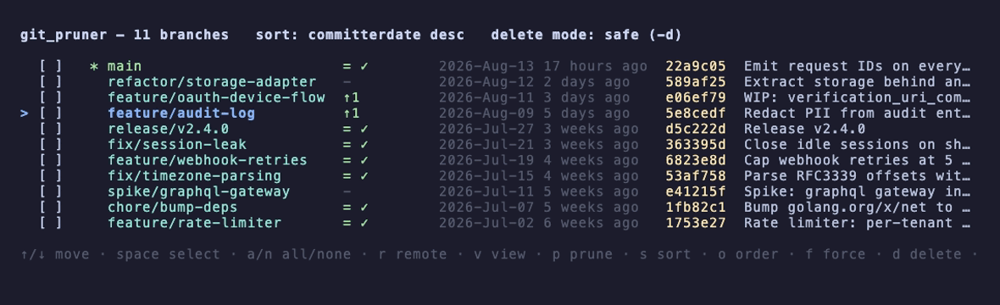

# git_pruner

An interactive terminal UI for pruning local git branches. It lists branches like
`git branch -vv --sort=-committerdate` (most recently committed first), lets you re-sort on the
fly, multi-select branches, and delete them — with a per-branch option to also delete the
matching remote branch.

You can also view a branch's changes as a colorized diff, and fetch-and-prune to find branches
whose upstream has been deleted so they can be cleaned up in one step.


Above: `p` fetches and prunes, marking three branches whose upstream was deleted and selecting
them; `space` and `r` add a merged branch and arm its remote deletion too; `d` opens the
confirmation, where `R` deletes local **and** remote.

## Install

Requires Go 1.26+ and git on your PATH.

```sh
./install.sh                   # build + install to a user bin directory
./install.sh --bindir ~/bin    # ...or pick the directory yourself
```

With no flags it installs to the first usable of `~/.local/bin` or `~/bin`, falling back to
`/usr/local/bin` (via sudo), and warns if the directory is not on your PATH. See
`./install.sh --help` for the details.

Then run it from inside any git repository:

```sh
git_pruner
```

To print the build's commit and date (from Go's automatic VCS stamping):

```sh
git_pruner version     # also --version, -v
```

## Keybindings

| Key            | Action                                                        |
| -------------- | ------------------------------------------------------------- |
| `↑`/`k`, `↓`/`j` | Move cursor                                                 |
| `g` / `G`      | Jump to top / bottom                                          |
| `space`        | Toggle selection (the current branch cannot be selected)     |
| `a` / `n`      | Select all / clear selection                                 |
| `r`            | Toggle "also delete remote" for the row (needs an upstream)   |
| `v`            | View the branch's diff (green additions / red removals)       |
| `p`            | Fetch `--all --prune`, then select gone branches that hold no unique work |
| `s`            | Cycle sort field: committerdate -> name -> ahead/behind       |
| `o`            | Reverse sort direction                                        |
| `f`            | Toggle delete mode: safe `-d` <-> force `-D`                  |
| `d` / `enter`  | Go to the confirmation screen                                 |
| `q` / `ctrl+c` | Quit                                                          |

On the confirmation screen, `n`/`esc` cancels. When no remote deletions are armed, `y` deletes.
When at least one remote deletion is armed (`R` in the row), the prompt splits so remote
deletion is never a single accidental keystroke: `y` deletes **local branches only** (sparing
the remotes), while `R` deletes **local + remote**. If any branch is then refused by the safe
delete (`-d`) because it isn't fully merged, a follow-up prompt offers to force delete (`-D`)
just those branches — `y` discards their unmerged commits, `n`/`esc` keeps them.

Deletions run in the background with a live progress screen (a spinner plus a per-branch
checklist), so the UI stays responsive while remote pushes complete.

In the diff view: `↑`/`↓` scroll, `space`/`ctrl+d` page down, `ctrl+u`/`pgup` page up,
`g`/`G` jump to top/bottom, and `q`/`esc`/`v` return to the list.

## Row format



```
> [x] R *  feature/foo        ↑2↓1 ✓  3 days ago   a1b2c3d  Fix the thing
```

- `>` cursor, `[x]` selected, `R` remote deletion armed, `*` current branch
- ahead/behind shown as `↑N↓M` (`=` when in sync, `gone` in red when the upstream was deleted)
- a green `✓` after the track column means the upstream is merged into the remote default
  branch — i.e. the remote is safe to delete
- relative commit date, short hash, and commit subject

## Viewing a branch's changes

Press `v` to see what a branch contains as a colorized patch — **green** for additions, **red**
for removals, magenta hunk headers. The diff is computed against the repository's default branch
(see [Resolving the default branch](#resolving-the-default-branch)) using a three-dot diff
(`git diff <base>...<branch>`), so it shows only the changes introduced on that branch since it
diverged. The view is scrollable for large diffs; the header shows which base it was compared to.

## Resolving the default branch

The default branch is used as the diff base, as the merge target for the `✓` indicator, and to
measure what a force delete would discard. It resolves to `<remote>/HEAD` if set, else
`<remote>/main`, else `<remote>/master`, trying each configured remote in turn with `origin`
first — so repositories whose only remote is named something else (`upstream`, a fork, …) still
get merge information. If no remote resolves, a local `main`/`master` is used.

## Pruning gone branches

Press `p` to run `git fetch --all --prune` in the background (the UI stays responsive). Once it
finishes, any local branch whose upstream was deleted is marked **gone**, and a status line
reports what was found. Press `d` to review and delete them.

This is the interactive equivalent of:

```sh
git fetch --all --prune && git branch -vv | awk '/: gone]/{print $1}' | xargs git branch -D
```

Gone branches are always removed with `git branch -D` (force), since `-d` refuses a branch whose
upstream no longer exists — this is why selecting them via `p` prunes them even in safe mode.

Because `-D` discards unmerged commits and git reports **no ahead/behind count for a gone
branch**, git_pruner measures each one against the default branch with `git cherry` and counts
the commits that have no equivalent patch there:

- gone branches holding **no** such commits are auto-selected by `p` — the one-keystroke workflow
- gone branches that **do** hold unique commits are left unselected and reported in the status
  line, so discarding them takes a deliberate `space`; the confirmation screen then shows
  `⚠ N commit(s) not in <base> — force delete (-D) will discard them`

`git cherry` is used rather than `git rev-list <base>..<branch>` so commits that were
cherry-picked, rebased, or squashed individually into the base are correctly recognized as
already integrated. A group of commits squashed together into one still counts as unique, since
no single equivalent patch exists — which is why the warning reads "not in `<base>`" rather than
claiming the work is unrecoverable.

## Deletion behavior

- Local: `git branch -d` by default (refuses unmerged branches); `f` switches to `git branch -D`.
  Branches whose upstream is **gone** are always deleted with `-D`, regardless of the mode, and
  the confirmation screen flags any commits that would be discarded (see above).
  When a `-d` delete is refused for being unmerged, a follow-up prompt lets you retry those
  branches with `-D` without leaving the results — no need to back out and re-select.
- Remote: when armed with `r`, runs `git push <remote> --delete <branch>`, where the remote is
  derived from the branch's upstream. Because this affects shared history, remote deletion
  requires the explicit `R` key on the confirmation screen — plain `y` deletes locals only.
  The confirmation screen also shows, per branch, whether the upstream is merged into the remote
  default (`✓ merged` / `⚠ not merged`) to help you judge whether the remote is safe to delete.
- A confirmation screen always lists exactly what will be deleted before anything happens.
  Deletions then run concurrently in the background on a live progress screen, and a results
  screen reports per-branch success or failure.

## Development

```sh
make build      # build straight to $BINDIR (default ~/shared/bin), skipping install.sh
make test       # go test ./...
make vet        # go vet ./...
make clean      # remove the binary from $BINDIR
make assets     # re-record the README's demo GIF and screenshot (needs vhs)
```

CI runs `gofmt`, `go build`, `go vet`, and `go test -race` on Linux and macOS for every push to
`master` and every pull request (`.github/workflows/ci.yml`).

The README's `assets/demo.gif` and `assets/branches.png` are generated, not hand-captured — rerun
`make assets` (needs [vhs](https://github.com/charmbracelet/vhs): `brew install vhs`) after any
change to the UI. It builds a throwaway repo under `/tmp/git_pruner-demo` with branches in every
interesting state — merged, stale upstream, unmerged work, no upstream — then records both assets
against that one repo so their commit hashes agree. The two tapes share their terminal settings
and setup via `assets/common.tape`, since the GIF and the still sit side by side in this file and
would look mismatched if the width or theme drifted between them.

[`docs/improvements.md`](docs/improvements.md) records the codebase analysis, the reasoning behind
the current safety behavior, and the roadmap of remaining work.

The test suite drives a real `git` binary against throwaway repositories created per test, so it
needs `git` on `PATH` and a committer identity (`user.name` / `user.email`); the tests set one
inside each temporary repo.

## License

[MIT](LICENSE)
